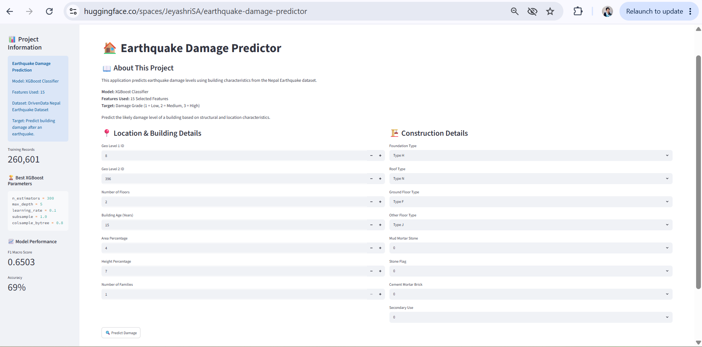
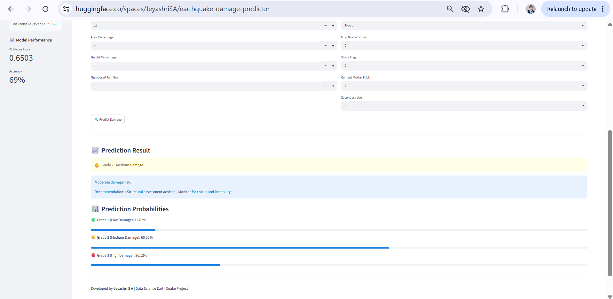

# 🚀 PRCP-1015: Earthquake Damage Prediction

This project predicts the severity of earthquake damage (`damage_grade`) for buildings using machine learning.

The model classifies buildings into:

- **1 → Low damage**
- **2 → Medium damage**
- **3 → Severe damage**

---

## 🌐 Live Demo

👉 **[🚀 Try the Earthquake Damage Prediction App](https://huggingface.co/spaces/JeyashriSA/earthquake-damage-predictor)**

An interactive web application built and deployed using :contentReference[oaicite:0]{index=0} Spaces.

You can input building features and get real-time predictions instantly.

---

## 🖼️ App Preview

### 📌 Input View

### 📌 Prediction Result

---

## 📌 Problem Statement

The objective is to predict earthquake-induced building damage based on structural and geographical attributes.

### Key Tasks:
- Perform Exploratory Data Analysis (EDA)
- Build a multi-class classification model for `damage_grade`
- Generate insights for improving earthquake-resistant construction

---

## 📂 Dataset Information

- Each record represents a building affected by the Gorkha earthquake  
- Dataset contains **39 features**
  - `building_id` → Unique identifier
  - 38 structural, geographical, and usage-based features  

🔗 Dataset Source:  
https://d3ilbtxij3aepc.cloudfront.net/projects/CDS-Capstone-Projects/PRCP-1015-EquakeDamagePred.zip

---

## 🧠 Machine Learning Approach

### 🔹 Workflow:
- Data Cleaning & Preprocessing  
- Feature Engineering  
- Encoding categorical variables  
- Model Training (Random Forest / XGBoost / Logistic Regression)  
- Model Evaluation  

### 🔹 Problem Type:
- Supervised Learning → Multi-class Classification  

### 🔹 Target Variable:
- `damage_grade` (1 = Low, 2 = Medium, 3 = Severe)

---

## 📊 Feature Categories

### 🌍 Geographic Features
- geo_level_1_id  
- geo_level_2_id  
- geo_level_3_id  

### 🏢 Structural Features
- count_floors_pre_eq  
- age  
- area_percentage  
- height_percentage  

### 🧱 Construction Materials
- foundation_type  
- roof_type  
- ground_floor_type  

### 🏗️ Superstructure Indicators
- adobe mud  
- cement mortar  
- timber  
- bamboo  
- RC engineered  

### ⚖️ Usage & Ownership
- legal_ownership_status  
- count_families  

### 🏠 Secondary Usage
- agriculture  
- rental  
- school  
- hospital  

---

## 📈 Model Performance

| Metric      | Score |
|------------|------|
| Accuracy    | 69%  |
| F1-score    | 0.6503 |
| Model Used  | XGBoost |

---

## 🏷️ Domain

Earthquake Engineering • Disaster Management • Machine Learning

---

⭐ If you like this project, feel free to star the repository!
